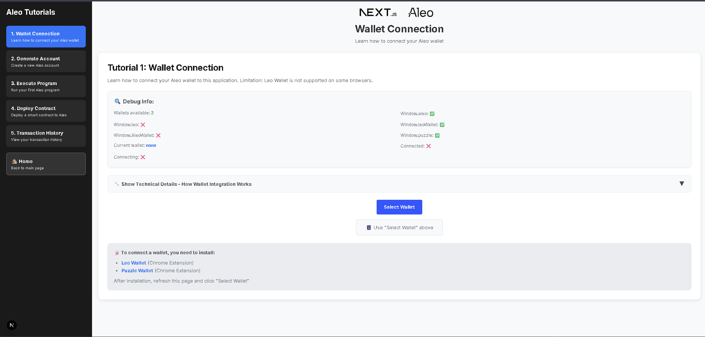

# Aleo Tutorial Project

A comprehensive Next.js application designed to teach Aleo blockchain development through interactive tutorials and seamless wallet integration.



## 🎯 What You'll Learn

This project provides hands-on experience with Aleo blockchain development, covering everything from wallet connections to smart contract deployment. Built with Next.js 15, React 18, and the official Aleo SDK, it offers a complete learning environment for blockchain developers.

## 🖥️ User Interface Overview

### Main Dashboard

The application features a clean, modern interface with intuitive navigation and professional Aleo branding. The dashboard provides easy access to all tutorials while maintaining a consistent user experience throughout.

### Tutorial 1: Wallet Connection

**Master the fundamentals of Aleo wallet integration**


**What you'll accomplish:**

- Connect to multiple Aleo wallets (Puzzle, Leo, Fox, Soter)
- Debug wallet detection issues in real-time
- Monitor connection status with live indicators
- Understand the technical architecture behind wallet integration

**Interactive features:**

```jsx
// Real-time wallet status display
Debug Information Panel:
✅ Wallets detected: 2
✅ Puzzle Wallet: Available
❌ Leo Wallet: Not detected
✅ Connection status: Connected
🔑 Public key: aleo1xxx...
```

### Tutorial 2: Account Generation

**Learn secure account creation and management**


**Key learning outcomes:**

- Generate cryptographically secure private keys using Web Workers
- Create new Aleo accounts with proper address derivation
- Implement secure local storage for account management
- Follow industry best practices for key security

### Tutorial 3: Program Execution

**Execute your first Aleo programs**


**Hands-on experience with:**

- Running Aleo programs with custom inputs
- Using the built-in Leo program editor
- Understanding Web Worker integration for performance
- Generating and verifying cryptographic proofs

### Tutorial 4: Contract Deployment

**Deploy smart contracts to the Aleo network**


**Professional deployment workflow:**

- Deploy smart contracts to Aleo's testnet and mainnet
- Calculate and manage deployment fees
- Select appropriate networks for different use cases
- Track deployment status and transaction confirmations

### Tutorial 5: Transaction History

**Monitor and analyze blockchain transactions**


**Comprehensive transaction management:**

- View detailed transaction history
- Analyze transaction details and execution status
- Monitor fee usage and gas consumption
- Integrate with Aleo's block explorer

## 🎨 Design Philosophy

### Intuitive Navigation

The application features a sophisticated dark-themed sidebar that provides:

- Clear tutorial progression with visual indicators
- Smooth animations and hover effects
- Responsive design that works on all devices
- Quick access to home and tutorial sections

### Educational Focus

Every tutorial includes expandable technical sections that reveal:

```jsx
🔧 Technical Deep Dive - Understanding the Implementation
├── 🏗️ Component Architecture Flow
├── 💡 Key Concepts and Dependencies
├── 📝 Real Code Examples
└── 🎓 Step-by-Step Explanations
```

### Real-Time Feedback

The interface provides immediate feedback through:

```jsx
Status Indicators:
├── 🟢 Connected: Wallet successfully linked
├── 🟡 Connecting: Connection in progress
├── 🔴 Disconnected: No active wallet connection
└── ⚠️ Error: Detailed error information with solutions
```

## 🛠️ Technical Architecture

### Project Structure

```
aleo-project/
├── src/
│   ├── app/                          # Next.js App Router
│   │   ├── tutorial/                 # Tutorial pages
│   │   │   ├── [id]/                 # Dynamic tutorial routes
│   │   │   │   └── page.tsx          # Individual tutorial page
│   │   │   └── components/           # Tutorial-specific components
│   │   │       ├── Tutorial1.tsx    # Wallet Connection
│   │   │       ├── Tutorial2.tsx    # Account Generation
│   │   │       ├── Tutorial3.tsx    # Program Execution
│   │   │       ├── Tutorial4.tsx    # Contract Deployment
│   │   │       ├── Tutorial5.tsx    # Transaction History
│   │   │       └── README.md        # Tutorial components docs
│   │   ├── layout.tsx               # Root layout with WalletWrapper
│   │   ├── page.tsx                 # Home page (redirects to tutorial/1)
│   │   └── globals.css              # Global styles
│   │
│   ├── components/                   # 🎯 MAIN COMPONENTS DIRECTORY
│   │   ├── WalletWrapper.jsx         # Main wallet integration
│   │   ├── examples/                 # Step-by-step examples
│   │   │   ├── BasicWalletSetup.jsx  # Minimal wallet setup
│   │   │   ├── AdvancedWalletConfig.jsx # Full configuration
│   │   │   └── WalletHooks.jsx       # Custom hooks
│   │   ├── workers/                  # Web Worker examples
│   │   │   ├── AleoWorker.js         # Main Aleo operations worker
│   │   │   └── WorkerManager.jsx     # Worker management
│   │   └── README.md                 # Components documentation
│   │
│   └── core/                         # Core utilities and constants
│       ├── constants.js              # App constants (PROGRAM_ID, etc.)
│       ├── processing.js             # Data processing utilities
│       ├── encoder.js                # Encoding/decoding utilities
│       └── reducers/                 # State management
│
├── public/                           # Static assets
│   ├── next.svg                      # Next.js logo
│   └── aleo.svg                      # Aleo logo
│
├── package.json                      # Dependencies and scripts
├── next.config.js                    # Next.js configuration
├── tsconfig.json                     # TypeScript configuration
├── PROJECT_STRUCTURE.md              # This file
└── README.md                         # Project overview
```

## 🎯 Key Locations for Tutorial Implementation

### 1. **WalletWrapper.jsx** → `src/components/WalletWrapper.jsx`

- **Purpose**: Main wallet integration component
- **Used in**: `src/app/layout.tsx` to wrap the entire app
- **Features**: Multiple wallet support, network configuration, permissions
- **Tutorial**: Foundation for Tutorial 1 (Wallet Connection)

### 2. **AleoWorker.js** → `src/components/workers/AleoWorker.js`

- **Purpose**: Web Worker for Aleo operations
- **Used in**: Tutorial 2 (Account Generation) and Tutorial 3 (Program Execution)
- **Features**: Thread pool initialization, private key generation, program execution
- **Benefits**: Keeps UI responsive during heavy computations

### 3. **Tutorial Components** → `src/app/tutorial/components/`

- **Purpose**: Individual tutorial implementations
- **Structure**: Each tutorial is a separate component for modularity
- **Benefits**: Easy to read, modify, and maintain individual tutorials

## 🔧 Component Usage Guidelines

### For WalletWrapper.jsx:

```jsx
// In src/app/layout.tsx
import { WalletWrapper } from "../components/WalletWrapper";

export default function RootLayout({ children }) {
  return (
    <html lang="en">
      <body>
        <WalletWrapper>{children}</WalletWrapper>
      </body>
    </html>
  );
}
```

### For AleoWorker.js:

```jsx
// In tutorial components
import { useEffect, useRef } from "react";

const workerRef = useRef(null);

useEffect(() => {
  workerRef.current = new Worker(
    new URL("../../../components/workers/AleoWorker.js", import.meta.url)
  );

  workerRef.current.onmessage = (event) => {
    // Handle worker responses
  };

  return () => workerRef.current?.terminate();
}, []);
```

### For Tutorial Components:

```jsx
// In src/app/tutorial/[id]/page.tsx
import Tutorial1 from "../components/Tutorial1";
import Tutorial2 from "../components/Tutorial2";
// ... etc

const renderTutorialContent = () => {
  switch (tutorialId) {
    case 1:
      return <Tutorial1 />;
    case 2:
      return <Tutorial2 />;
    // ... etc
  }
};
```

## 📚 Educational Benefits of This Structure

### 1. **Clear Separation of Concerns**

- **Components**: Reusable UI and logic components
- **App**: Next.js specific routing and pages
- **Core**: Shared utilities and constants
- **Workers**: Heavy computation isolation

### 2. **Progressive Learning Path**

- Start with `BasicWalletSetup.jsx` for minimal implementation
- Progress to `WalletWrapper.jsx` for full features
- Use `AleoWorker.js` for understanding Web Workers
- Explore individual tutorial components for specific features

### 3. **Easy Code Navigation**

- Each tutorial has its own file for focused learning
- Related components are grouped together
- Clear naming conventions for easy discovery
- Comprehensive documentation in each directory

### 4. **Scalable Architecture**

- Easy to add new tutorials without affecting existing ones
- Components can be reused across different tutorials
- Workers can be extended for additional operations
- Clear extension points for advanced features

## 🚀 Getting Started

1. **Study the WalletWrapper**: Start with `src/components/WalletWrapper.jsx`
2. **Explore Examples**: Check `src/components/examples/` for different approaches
3. **Understand Workers**: Review `src/components/workers/AleoWorker.js`
4. **Follow Tutorials**: Work through `src/app/tutorial/components/` in order
5. **Experiment**: Modify components to understand their behavior

## 🔄 Migration from Old Structure

If you have components in the old locations:

1. **Move WalletWrapper**: `src/app/WalletWrapper.jsx` → `src/components/WalletWrapper.jsx`
2. **Move Worker**: `src/app/worker.ts` → `src/components/workers/AleoWorker.js`
3. **Update Imports**: Change import paths in layout.tsx and tutorial components
4. **Update Worker URLs**: Change worker URLs in tutorial components

This structure provides a clear, educational, and maintainable foundation for learning Aleo development!
